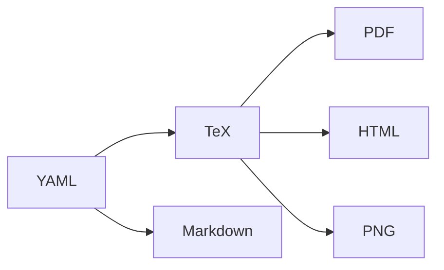

---
tags:
  - blog
  - howto
  - jobsearch
  - LaTeX
  - Markdown
author: ktneely
copyrighted: "True"
date: 2024-11-27
title: Creating a Text-based Résumé workflow
---

**Image: a typical resume content extraction workflow from neurond.com**


I used to keep my résumé (from here, “resume”) very up-to-date.  For a long time, I have had a resume crafted in #LaTeX because I have a long history with using that typesetting and markup language for purposes other than the ones most people think of, e.g. I wrote my college English papers in it, I had a slew of templates I created while I was a practicing attorney that would create letters, motions, and envelopes from source `.tex` files, etc.  

**TL;DR** I ended up using [RenderCV](https://github.com/sinaatalay/rendercv) as mentioned below in the  [[Resume Workflow#RenderCV|RenderCV section]].

In the time since I last relied upon a resume, the method of applying for jobs –and more importantly, how recruiters review submissions– has changed pretty drastically.  And despite all the great advances in technology over the past ten years, apparently, HR systems still are not that great at parsing a PDF or Word doc into text that can be machine-read by whatever algorithms and/or AI they’re using to perform the first pass.  Because of this, you want to make sure to submit a machine-friendly description of your experience.  There really should be a standard for all this stuff that makes it easy on both the applicant and the hiring manager.  Like, I don’t know, some sort of [HR standards body]( https://www.hropenstandards.org/) or something.  A standard has never emerged, and I suspect that LinkedIn has a lot to do with that.  


Additionally, having an easy way to keep one’s resume in sync and in multiple formats means that it can be quickly used for many purposes, from printing an attractive hard copy to piping it through some [[Fabric]] AI workflows.  So this set me on a fairly long hunt for a system where I could write once, and generate in multiple formats.  


# The search for a resume workflow

## First round
### LaTeX & Pandoc

Since my resume was already in LaTeX, using the [20 second CV](https://github.com/spagnuolocarmine/TwentySecondsCurriculumVitae-LaTex) set of template –which I think is very nice– I went and updated that and then ran it through `pandoc`, which is a multi-format document converter.  The results ended up being pretty poor and not useful.  The PDF looked great, obviously, but pandoc did not understand the LaTeX very well and the Markdown required a lot of edits.  

We want everything to look good upon compilation/export/save as/whatever, so this was not an option.


## Interlude
I had kind of given up at this point, figuring I either needed to just go Google Docs or maintain a Markdown version and attempt to keep them in sync.  Then, I came across a post about an [auto-application bot](https://github.com/feder-cr/linkedIn_auto_jobs_applier_with_AI) and the author had a related project that used resume information formatted as [YAML](https://yaml.org/) to create a specific resume based upon job description or LinkedIn post.  
### Resume from Job Description

This project is called [resume render from job description](https://github.com/feder-cr/resume_render_from_job_description) (no cute animal names or obtuse references in *this* project!), and I gave it a try, but it appeared to *require* all the fields, including e.g. GPA.  I don’t know about you, but I'm way past the point in my career where I'm putting my GPA on a resume, so it wasn’t that useful.

It was late on a Thursday night, so obviously it was time to look a bit further into the rabbit hole


### Online options

I found a number of projects that were a service model where they host and render the resume for you.  These included [resume.lol](https://www.resume.lol/) (I question the naming choice here), [Reactive resume](https://docs.rxresu.me/) (opensource, excellent domain name, and it has nice documentation), and [WTF resume](https://medevel.com/15-os-resume-builder/)  (my thought exactly!).

These all came from a post of [14 Open-source Free Resume Builder and CV Generator Apps](https://medevel.com/15-os-resume-builder/).
#### JSONResume

As I traveled further down the Internet search rabbit hole, I came across [JSON Resume](https://jsonresume.org/), an #opensource project with a hosting component where people craft their resumes in [JSON](https://json.org/) and it can then render in a number of formats either via a command-line tool or within their hosted service, making it a kind of hybrid option. 

At this point, I felt like I was *almost there*, but it wasn’t exactly what I wanted.  JSONResume is very focused around being part of their ecosystem and publishing within their hosting ecosystem.  The original #CLI tool is no longer maintained, and a new one is being worked on, which appears minimal but sufficient for the task.  A nice thing is that they have some add-ons and have created a sort of ecosystem of tools.  Looking over the project’s 10 year history, those tools have a tendency to come and go, but such is the nature of OSS.  

## The Award for “Project Most Suited to My Workflow” goes to….

Another great thing about JSON Resume is that they, i.e. Thomas Davis, have done a fantastic job of cataloging various resume systems out there in their [JSON Resume projects](https://jsonresume.org/projects) section.  There is so much interesting stuff here –and a lot of duplicative effort *ahem* see the “HR Standards” comment above– that you can spend a couple days looking for the project that best fits your needs.  For me, I landed on RenderCV, which is not only in the bibliography, but also mentioned on the [Getting Started](https://jsonresume.org/getting-started) page because there are tools to leverage JSON Resume from RenderCV!  

So *without further ado…*
### RenderCV

While [RenderCV](https://github.com/sinaatalay/rendercv) is a part of the JSON Resume ecosystem, in that people have created scripts to convert from the latter to the former, it is a *completely separate and standalone project*.  Written in #python and installable via `pip`.  RenderCV’s approach is to leverage a YAML file, and from that generate consistent resumes in PDF, HTTML, Markdown, and even individual PNG files, allowing the applicant to meet whatever arcane requirements the prospective employer has.


*Resume generation workflow*

#### Using RenderCV

Getting started with RenderCV is like pretty much any other project built in python

1. Create a virtual environment using `venv` or `conda`, e.g. `conda create -n renderCV python=3.12.4`
2. Install via pip with a simple command `pip install rendercv`
3. Follow the [quick start guide](https://github.com/sinaatalay/rendercv?tab=readme-ov-file#quick-start-guide) and create a YAML file with your information in it
4. Run `rendercv render <my_cv>.yaml`
5. View the lovely rendered résumé 

#### Extending RenderCV

This was great, as I now have a very easy-to-edit source document for my résumé and can quickly create others.  I’m hoping Sina, the author, makes the framework a bit more extensible in the future because the current templates are oriented toward people with STEM backgrounds looking for individual contributor roles.  However, as some of us move further in our careers, the résumé should be less about skills and projects, but more about responsibilities and accomplishments as we lead teams.  I have enhanced the “classic” and “sb2nov” themes so that they take these keywords as subsections to a specific company/role combination under the `professional_experience` section.

##### Theme update for Leaders and Managers

I [created a fork](https://github.com/ktneely/rendercv4leaders) which contains updates to v1.14, adding the "Responsibilities" and "Accomplishments" subsections for `company:` under the Experience section.  
This allows leaders to craft their resume or CV in such a way that it highlights the breadth of their influence and impact to the organization.

The following themes support the additional subsections:
  - markdown
  - classic
  - sb2nov

A non-updated theme will simply ignore the content under these subsections; omitting these sections will make the resume look like the original theme.
Hopefully the framework will be more extensible in the future and I can add this as a pull request.  
In the meantime, the forked repo at [https://github.com/ktneely/rendercv4leaders](https://github.com/ktneely/rendercv4leaders) should work on its own, or the `/ExperienceEntry.j2.tex` and `/ExperienceEntry.j2.md` files from those themes can simply be copied over the existing.

##### How to use
Usage is extremely straightforward, as this merely extends the framework with a couple new keywords for the *Experience* section and looking for a preceding `company` declaration.  Here is an example:

```yaml
professional_experience:
  - company: NASA
	position: Director of Flight Operations
	location: Houston, TX
	start_date: 1957-03
	end_date: 1964-06
	responsibilities:
	  - Manage the Control room.
	  - Write performance reports.
	  - Smoke copious amounts of cigarettes
	accomplishments:
	  - 100% staff retention over the course of 9 rocket launches.
	  - Mobilized and orchestrated multiple teams to rescue astronauts trapped in space.
	  - Lung cancer.
```

This will then render “responsibilities” and “accomplishments” as italicized sections under the job role, highlighting what a difference made while performing in that role.
## References and further exploration

1. Neurond.com blog post: [What is a CV/Resume Parser and How Does it Work?](https://www.neurond.com/blog/what-is-a-cv-resume-parser-how-it-works), Trinh Nguyen, Aug 16, 2022.
2. [TeXMaker: an Open-source TeX editor](https://www.xm1math.net/texmaker/) 
3. [RenderCV user guide](https://docs.rendercv.com/user_guide/) 