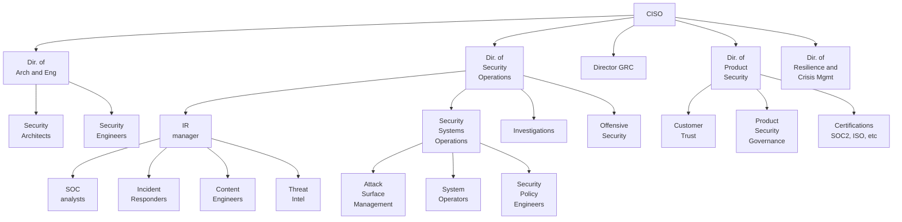

The following flowchart is what I think a logical security organization's structure might look like.  There will always be differences and constraints due to other ways that the company is structured, but this is a decent starting template.

This was how we had structured the teams in a previous company, and it came about in a sort of organically-planned way, in that the different teams had been identified back when the team was only 8 strong and people wore multiple hats, and then we were able to fill out the management and IC layers as we added staff.  Basically, going from top down, we have a VP, Directors, Managers, and then ICs.  While some people may have had "Sr." in their title, it doesn't really make a difference from a structural point of view when the overall team is under 40 people. 

